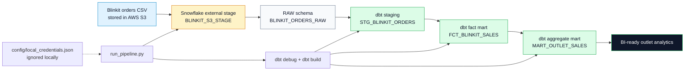
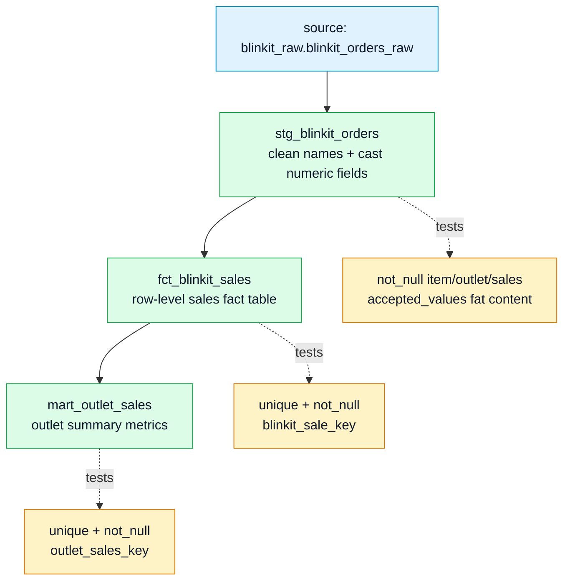

# Blinkit Snowflake dbt Pipeline

Public portfolio project showing an end-to-end analytics engineering workflow: load Blinkit retail sales data into Snowflake, transform it with dbt, and publish clean staging and mart models for reporting.

## What This Project Demonstrates

- Snowflake warehouse, database, schema, file format, stage, and raw table setup
- S3-to-Snowflake raw ingestion pattern
- dbt staging model for cleaning raw CSV columns
- dbt mart models for fact and outlet-level analytics tables
- Schema tests for uniqueness, null checks, and accepted values
- Public-safe credential handling with ignored local config files
- One-command local runner for bootstrap, dbt build, and row-count checks

## Architecture



## dbt Lineage



## Final Models

| Layer | Model | Purpose |
| --- | --- | --- |
| Source | `BLINKIT_DB.RAW.BLINKIT_ORDERS_RAW` | Raw CSV data loaded from S3 |
| Staging | `STAGING.STG_BLINKIT_ORDERS` | Cleaned and typed source records |
| Mart | `MARTS.FCT_BLINKIT_SALES` | Sales fact table with generated sale keys |
| Mart | `MARTS.MART_OUTLET_SALES` | Outlet-level sales and rating summary |

## Repository Structure

```text
.
├── dbt_project.yml
├── profiles.yml.example
├── config/
│   └── local_credentials.example.json
├── macros/
│   └── generate_schema_name.sql
├── models/
│   ├── staging/
│   └── marts/
├── scripts/
│   ├── run_pipeline.py
│   └── run_dbt.sh
├── sql/
│   └── bootstrap_snowflake.sql
└── requirements.txt
```

## Public-Safe Credential Setup

This public repository does not commit real credentials and does not require environment variables.

Create local-only files from the examples:

```bash
cp profiles.yml.example profiles.yml
cp config/local_credentials.example.json config/local_credentials.json
```

Then edit both local files with your Snowflake and AWS values. These files are ignored by git:

- `profiles.yml`
- `config/local_credentials.json`
- `.user.yml`

## Install

```bash
python3 -m venv .venv
source .venv/bin/activate
pip install -r requirements.txt
```

## Run the Full Pipeline

```bash
python scripts/run_pipeline.py
```

The runner will:

1. Read local credentials from `config/local_credentials.json`.
2. Inject AWS placeholders into `sql/bootstrap_snowflake.sql` in memory only.
3. Create Snowflake objects and load the raw S3 CSV.
4. Run `dbt debug`.
5. Run `dbt build`.
6. Print row counts for raw, staging, and mart tables.

## Run dbt Only

Use this after Snowflake raw data has already been loaded:

```bash
bash scripts/run_dbt.sh
```

Or run dbt manually:

```bash
dbt debug --profiles-dir .
dbt build --profiles-dir .
dbt docs generate --profiles-dir .
dbt docs serve --profiles-dir .
```

## Data Quality

The project includes dbt tests for:

- Required item and outlet identifiers
- Required sales values
- Valid fat-content categories
- Unique generated sale keys
- Unique generated outlet summary keys

## Security Notes

Do not commit:

- Snowflake usernames or passwords
- AWS access keys
- `profiles.yml`
- `config/local_credentials.json`
- dbt `target/`
- dbt `logs/`
- Python virtual environments

The committed files contain placeholders only.
